# UN Stats

## What is it

A mini data science project to process the UN Population and GDP data based on user inputs using NumPy/Pandas and display the statistics using Matplotlib

Below datasets are used in the project

+ [UN Region, Sub-Region and Country](https://data.un.org/_Docs/SYB/CSV/SYB63_1_202105_Population,%20Surface%20Area%20and%20Density.csv)

+ [Population Growth, Fertility, Life Expectancy and Mortality](https://data.un.org/_Docs/SYB/CSV/SYB62_246_201907_Population%20Growth,%20Fertility%20and%20Mortality%20Indicators.csv)

+ [Population in the Capital City, Urban and Rural Areas](https://data.un.org/_Docs/SYB/CSV/SYB61_253_Population%20Growth%20Rates%20in%20Urban%20areas%20and%20Capital%20cities.csv)

+ [GDP and GDP per Capita](https://data.un.org/_Docs/SYB/CSV/SYB63_230_202009_GDP%20and%20GDP%20Per%20Capita.csv)


### Course Instructor

[Dr. Emily Marasco](https://schulich.ucalgary.ca/contacts/emily-marasco)


### Group Members

[Bhavyai Gupta (myself)](https://github.com/zbhavyai)

[Brandon Attai](https://github.com/b-attai)


## Features

+ Decide what data statistics you want by the use of menu options

+ Print stats for the entire dataset or for a subset of data

+ Compare countries on various statistics and plot the graphs


## Dependencies

+ numpy 1.20.3

+ pandas 1.2.4

+ matplotlib 3.4.2

+ openpyxl 3.0.7


## How to use

+ Run the `launch.py` file

   ```python
   python launch.py
   ```

+ Follow the onscreen instructions


## Screenshots

+ Launching the program

   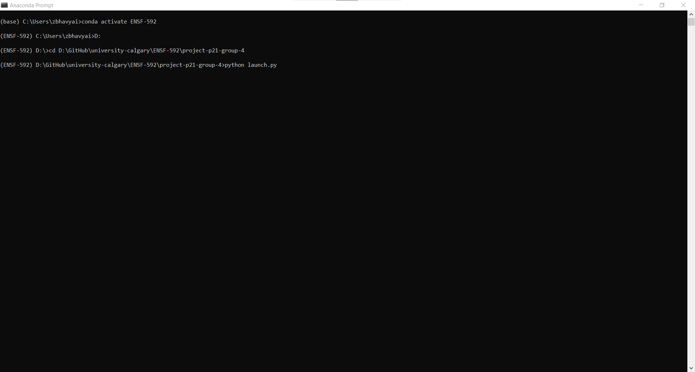


+ Initial checks by the program

   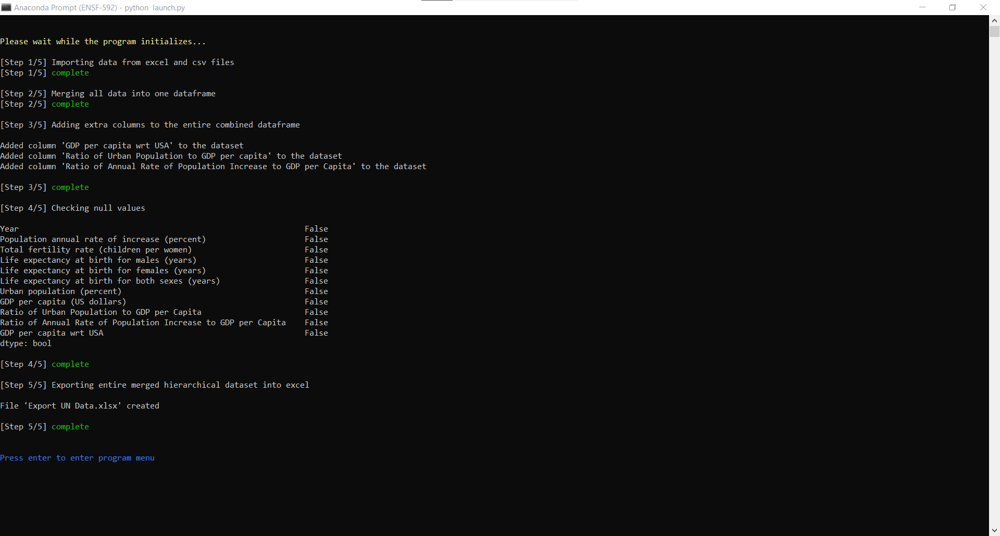


+ Program Menu

   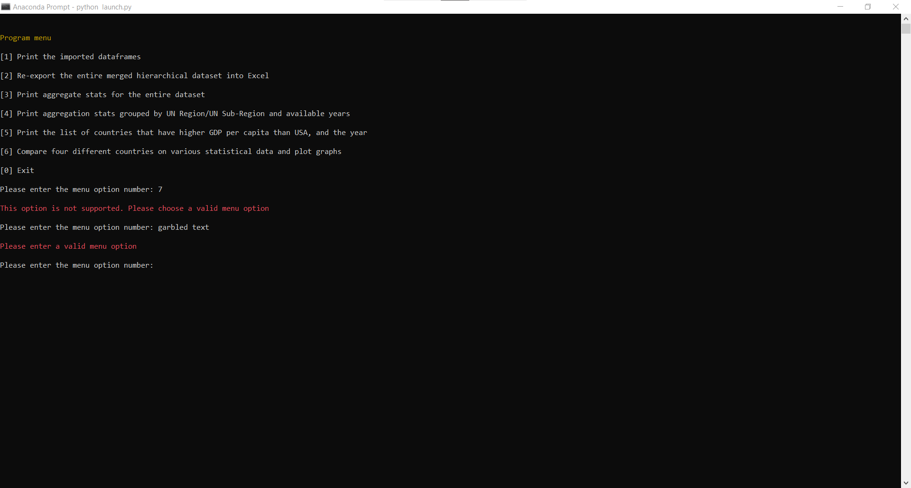


+ Menu Option 1: Print Dataframes

   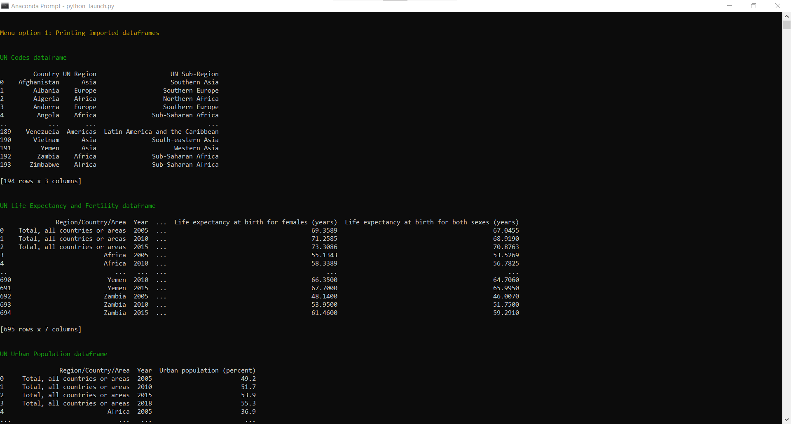

   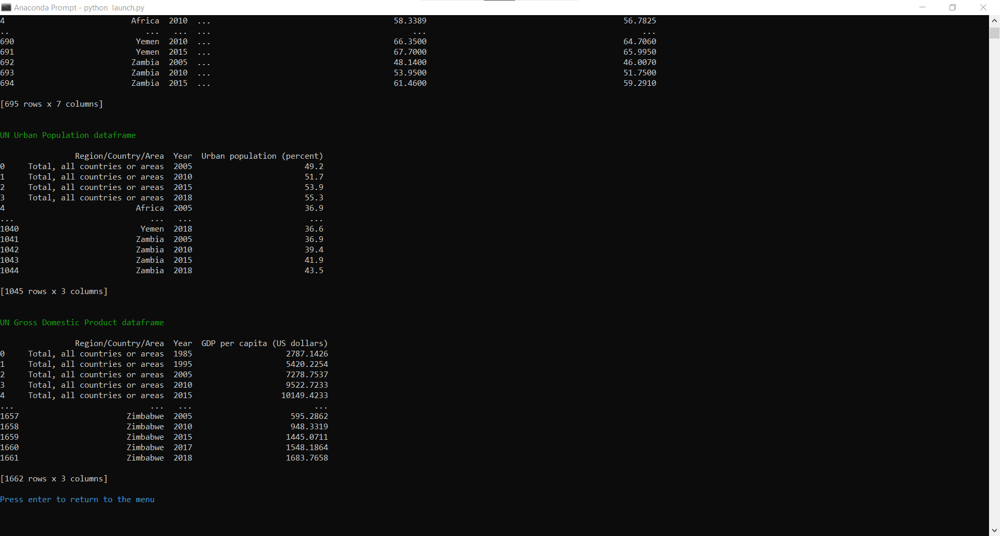


+ Menu Option 2: ReExporting Dataframe

   


+ Menu Option 3: Aggregate Stats for entire dataset

   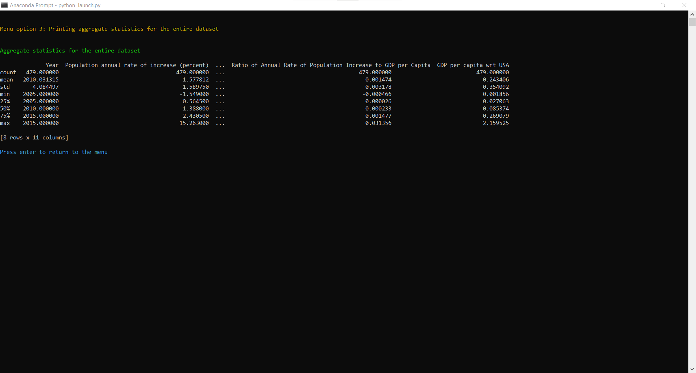


+ Menu Option 4: Aggregate Stats for subset of data

   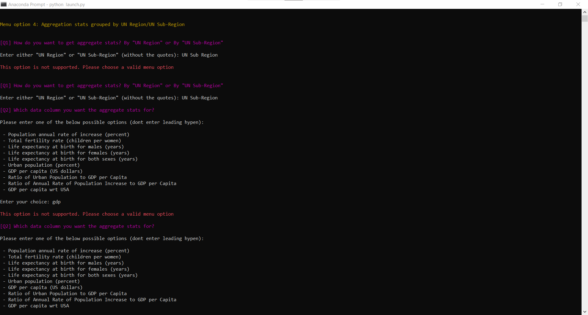

   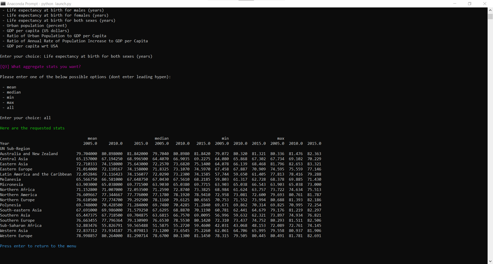


+ Menu Option 5: Countries with higher GDP per capita than USA

   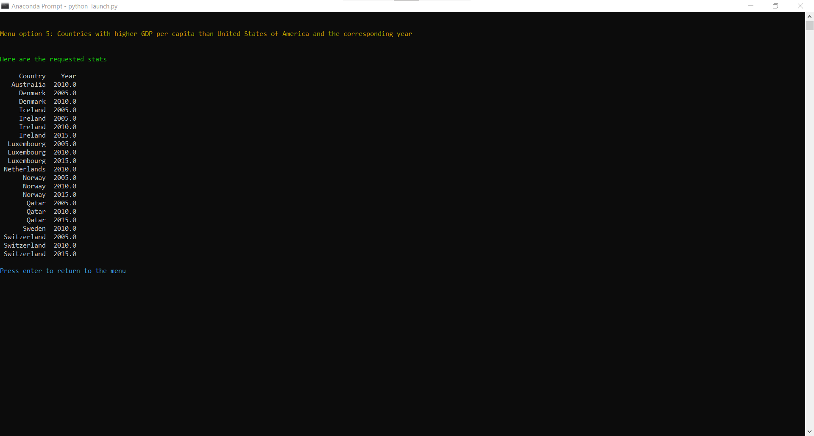


+ Comparing four distinct countries on various statistics

   

   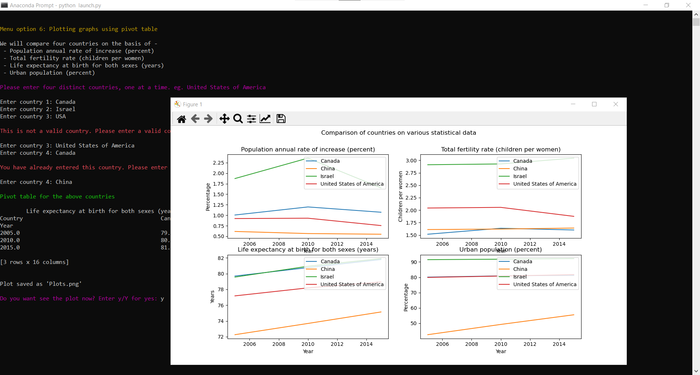


+ Exiting the program

   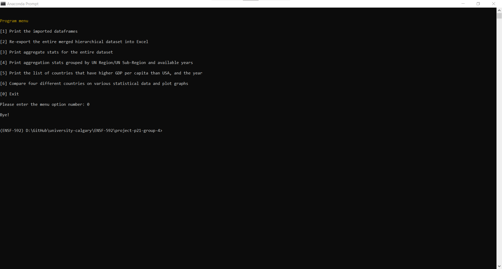
